## Entornos virtuales


### ¿Qué es un entorno virtual?


### Utilidad


* Tenemos un entorno limpio en el que sólo tendremos los paquetes necesarios
* Nos permite compartir la configuración necesaria para que otro usuario replique nuestro entorno


Al seleccionar el intérprete seleccionamos el entorno virtual

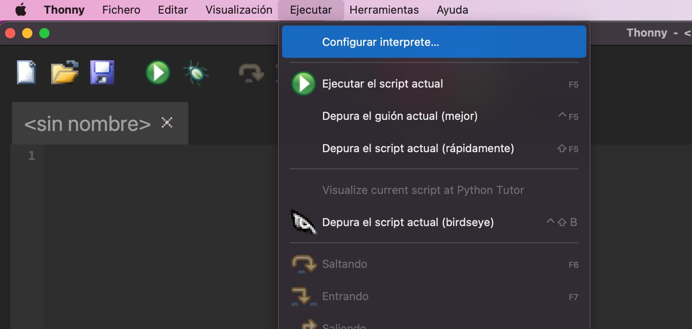


Ahora cuando queramos instalar un paquete

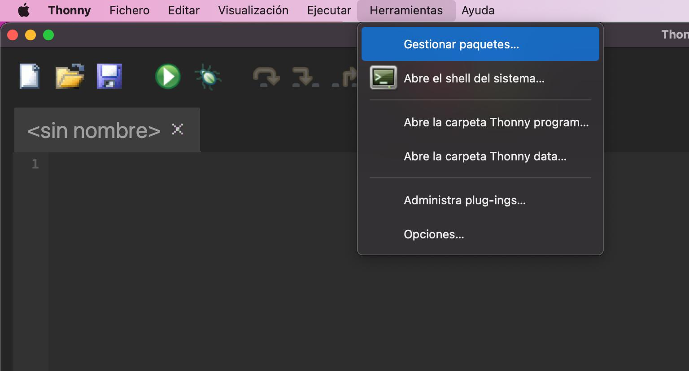


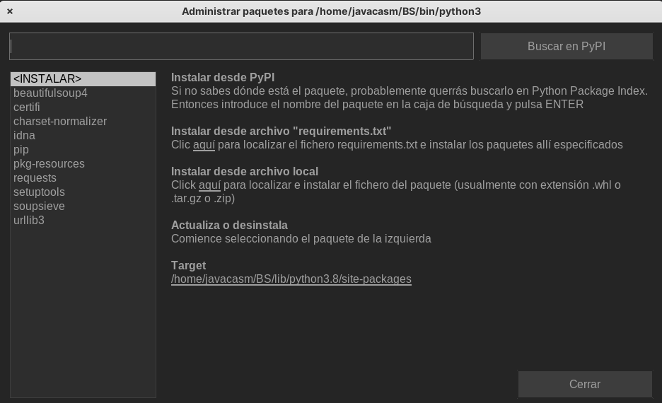


Usando el menú de Ejecutar -> Configurar Intérprete


Accedemos a la configuración del intérprete que usaremos

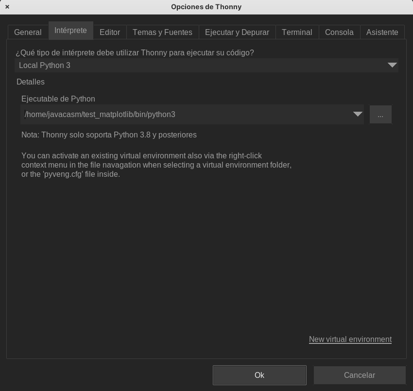

Donde un desplegable nos permite seleccionar entre los distintos intérpretes disponibles y los entonos virtuales ya creados

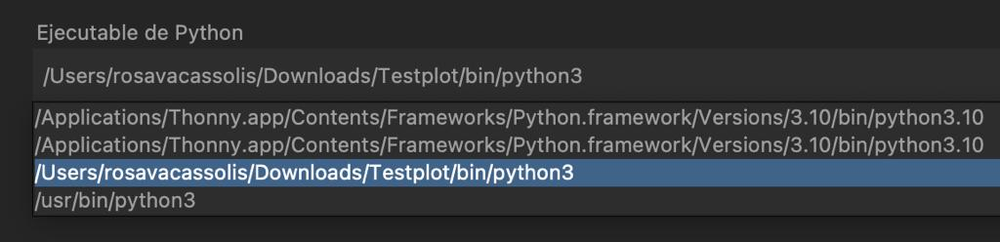


### Tipos de entornos virtuales

Existen diferentes tipos de entornos virtuales

¿?
venv
conda


### Uso de entornos virtuales desde consola

Todo esto lo podemos hacer también desde la consola

```sh

source bin/activate

```

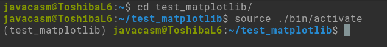

Donde vemos que nos muestra el entorno virtual que estamos usando en este momento.

Para salir haremos

```sh
deactivate
```


## Entornos virtuales desde Visual Studio Code

Desde la carpeta donde queremos crearlos

Pulsamos Ctrl + Shift + P para desplegar la paleta de acciones y escribimos "Python: create env"

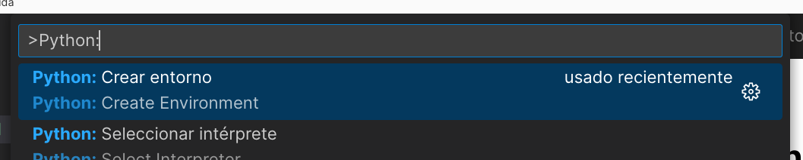

Seleccionamos el tipo de entorno virtual, venv en nuestro caso

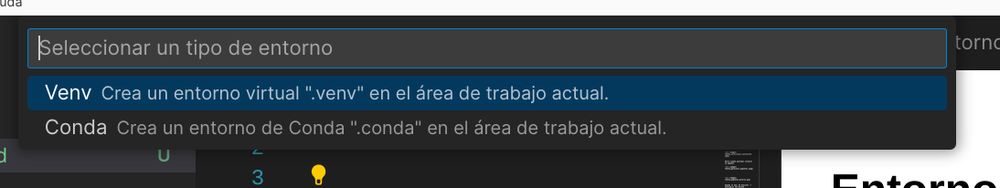

Seleccionamos el intérprete que queremos usar

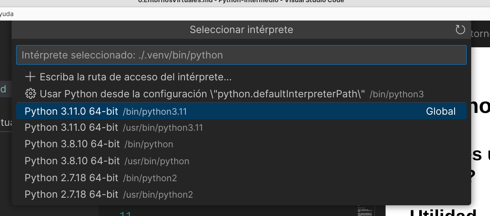

Ahora para seleccionar uno de ellos

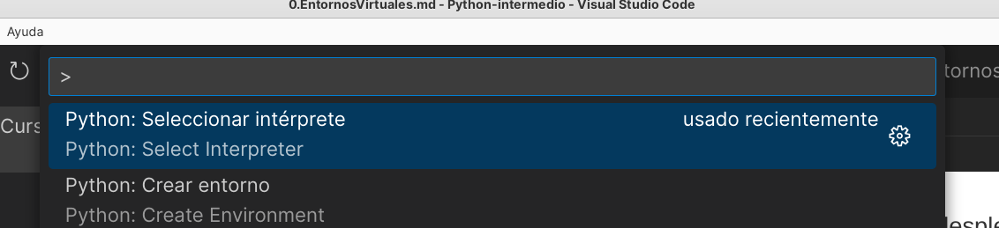

y seleccionamos el que queramos entre los disponibles

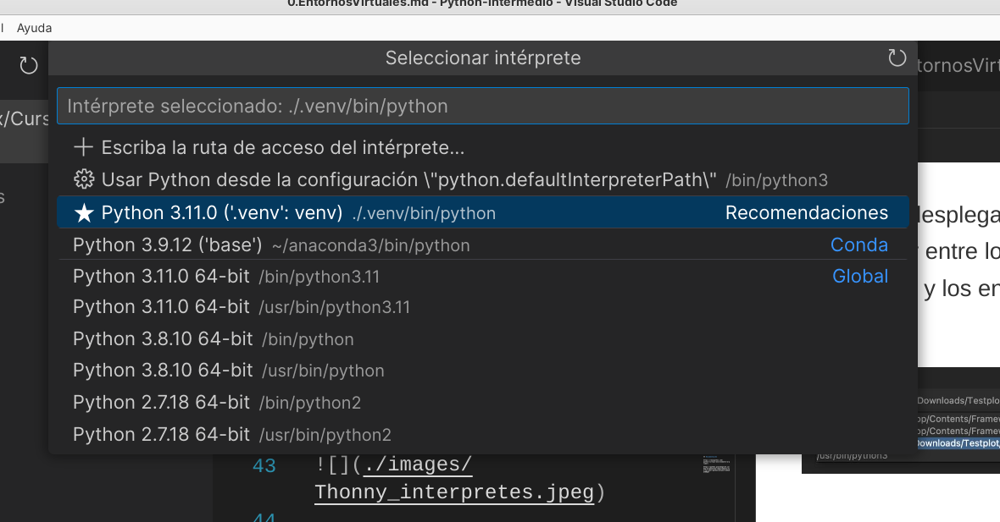


Cuando abramos un fichero python desde dentro de un entorno virtual, lo veremos indicado en la barra de estado

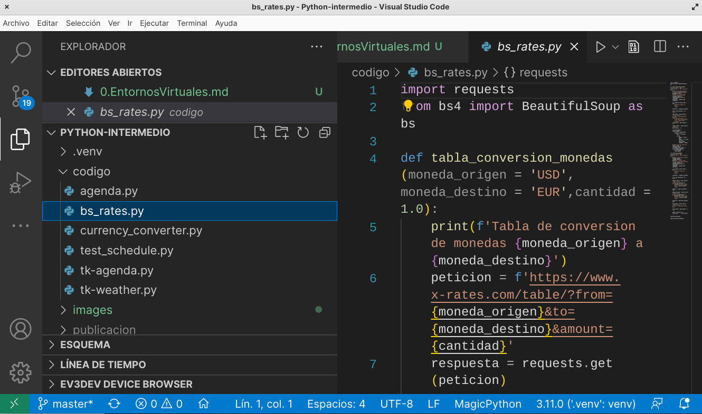

## Generando la lista de paquetes: requeriments.txt

Desde un entorno virtual podemos generar el listado de módulos y paquetes instalados usando __pip freeze__. Normalmente guardamos esta lista en un fichero llamado **requeriments.txt** 

```sh
pip freeze > requirements.txt
```

Podemos instalar todos esos paquetes también desde pip usando este fichero:

```sh
pip install -r requirements.txt
```

Lo que nos facilita enormemente el poder replicar un entorno en otro ordenador.

Desde Thonny podemos abrir una shell (consola o terminal) del sistema operativo que nos permite usar el intérprete Python incluído en Thonny y sus herramientas. Lo abriremos desde el menú "Herramientas" -> "Abrir shell"

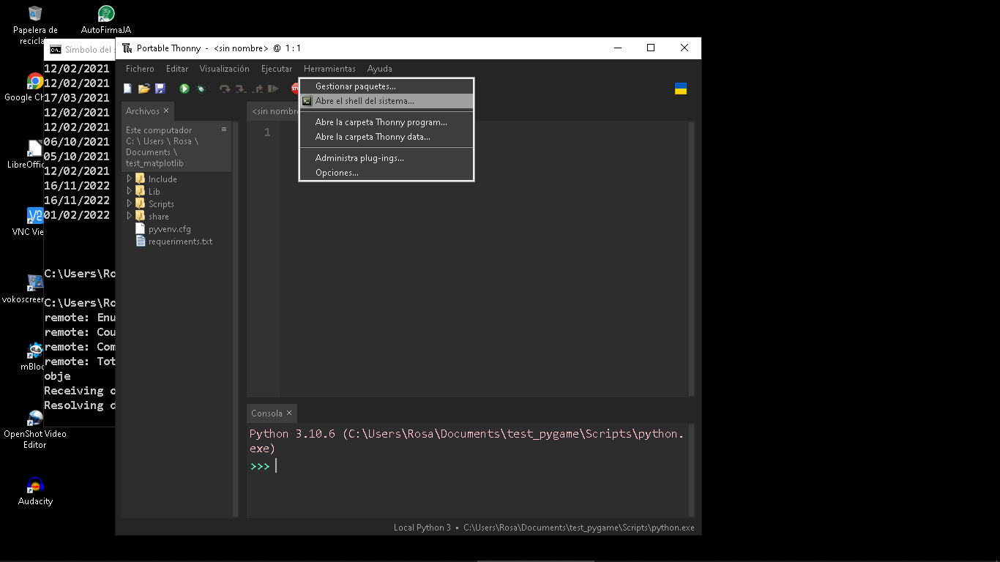 

Una vez abierto la shell 

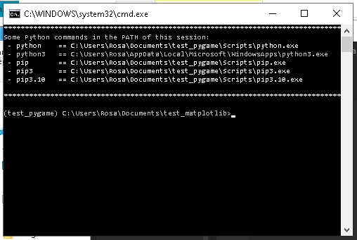

Podemos ejecutar pip paa generar el fichero __requeriments.txt__

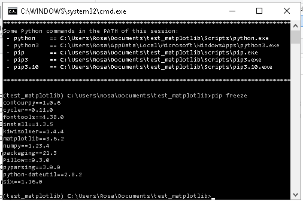

Del mismo modo también podemos replicar un entorno teniendo el fichero con el listado de paquetes.

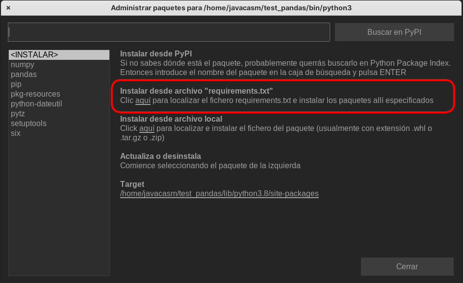

#### Vaios


## Documentación

https://realpython.com/python-virtual-environments-a-primer/

https://python.plainenglish.io/how-to-generate-requirements-txt-for-your-python-project-235183799d2f
