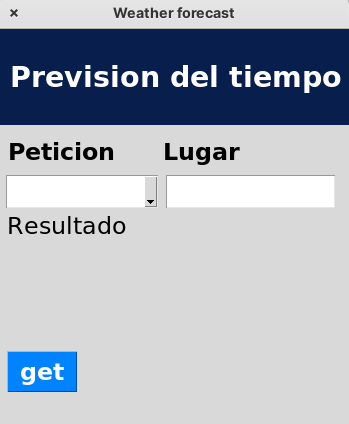
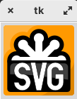

## Librería Tkinter

### App sencilla

Vamos a crear una aplicación que nos permita obtener el tiempo actual o el pronóstico de cualquier localidad para lo que usaremos el código que ya hicimos. La aplicación nos permitirá seleccionar entre el tiempo actual o el pronóstico. También tendremos que facilitar la localización que queremos utilizar. 



* Importamos todos los elementos de la librería **Tk** 

```python
from tkinter import *
```

* Creamos la ventana base y definimos su geometría: ancho x alto + x + y, definiendo unas variables para el tamaño que usaremos a lo largo del programa

```python
base_window = Tk()
ancho_ventana = 350
alto_ventana = 400
base_window.geometry(f'{ancho_ventana}x{alto_ventana}+1200+200')
```

* Asignamos un título a la ventana

```python
base_window.title('Weather forecast')  # asignamos un título
```

* Establecemos el comportamiento de la ventana para que no se pueda modificar sus dimensiones

```python
base_window.resizable(height=False,width=False)  # definimos su comportamiento ante cambios de tamaño
```

* Definimos los colores que vamos a usar, utilizando el formato RGB de 6 cifras hexadecimales, 2 para cada color. Podemos seleccionar los colores desde [esta página](https://www.w3schools.com/colors/colors_picker.asp)

```python
# Colores 
# Selección con https://www.w3schools.com/colors/colors_picker.asp
color_blanco = '#FFFFFF'
color_negro = '#000000'
color_titulo = '#081F4D'
color_boton = '#0083FF'
```

* Para colocar los controles utilizaremos **frames** (marcos) que nos permiten organizar los controles dentro de la ventana y asignarles colores y aspectos distintos. El __frame__ superior tendrá un color diferente y contendrá el título. Vemos como al crearlo le pasamos como argumento la ventana de la que colgará y definimos su color de fondo, su ancho y alto. También le asignamos una fila y columna para "colocarlo" dentro de la ventana base.

```python
top_frame_titulo = Frame(base_window,
                         bg = color_titulo,
                         width = ancho_ventana,
                         height = 80)

top_frame_titulo.grid(row=0,column=0) #
```

* Ahora colocamos un control de tipo label (etiqueta) que actuará como "título" de nuestra aplicación y al que le daremos un color de fondo y un tipo de letra. No hay que confundir esta etiqueta con el título de la ventana que asignamos antes:

```python
label_titulo = Label(top_frame_titulo,
                      text = 'Prevision del tiempo',
                      bg = color_titulo,
                      fg = color_blanco,
                      pady = 30, padx = 10,
                      justify = CENTER,
                      font = ('Poppins 18 bold'))
 
label_titulo.grid(row=0,column=0) 
```

* Ahora vamos a definir un Frame para la parte de abajo donde pondremos los controles y le damos la posición de la fila segunda. 

```python
main_frame = Frame(base_window,
                   width = ancho_ventana,
                   height = alto_ventana - 80)
main_frame.grid(row = 1,column = 0)
```

* Añadimos los 2 label que muestra qué debemos poner en cada control. Les pondremos el mismo tipo de letra

```python
font_etiquetas = ('Poppins 15 bold')
font_courier = ('Courier', 18, 'bold')

label_tipo_peticion = Label(main_frame,
                            text = 'Peticion',
                            font = font_etiquetas,
                            justify = LEFT)
label_tipo_peticion.place(x = 5,y = 0)

label_lugar = Label(main_frame,
                    text = 'Lugar',
                    font = font_etiquetas,
                    justify = RIGHT)

label_lugar.place(x = 160,y = 0)  
```

* Creamos un control de tipo **Combo** que es un selector. También definimos la lista de los posibles valores entre los que se pueden elegir y el ancho en número de caracteres.

```python
tipo_peticion = ['actual','pronostico']
combo_tipo_peticion=ttk.Combobox(main_frame,
                                 values = tipo_peticion,
                                 width = 9,
                                 font = font_texto)
combo_tipo_peticion.place(x = 10,y = 32)
```
* Ahora vamos a incluir un control Entry (texto editable) para que se introduzca el lugar. Establecemos el ancho en número de caracteres y la fuente a usar.

```python

from tkinter import ttk

entry_lugar = ttk.Entry(main_frame,
                        width = 11,
                        font = font_texto)
entry_lugar.place(x = 170, y = 32)
```

* Añadimos ahora un control Text (texto largo) para que se muestre el resultado. Establecemos  el número de caracteres de ancho y las filas, también el tipo de letra.

```python
text_resultado = Text(main_frame,
                      width = 22,
                      height = 6,
                      wrap = WORD,
                      font = font_texto,
                      state = 'normal')

text_resultado.insert(INSERT,"Aqui se mostrara el resultado de haber hecho la peticion")
text_resultado.place(x = 5, y = 72)
```

* Por último vamos a añadir un **Button** (botón) del que definiremos su texto, color de fondo y del texto así como la función a la que se llamará al pulsarlo:

```python
button_get = Button(main_frame,
                    text = 'get',
                    bg = color_boton,
                    fg = color_blanco,
                    font = font_etiquetas,
                    command = get_weather)

button_get.place(x = 5, y = 255)
```

* Esta función se ejecutará al pulsar el botón y se encargará de leer los valores de los controles. Si no se ha seleccionado un tipo de petición y un lugar se mostrará una ventana de error, usando el método **showerror** de **tkinter.messagebox**. Si los controles tiene valores se hará la petición y se mostrará el resultado en el control text_resultado:

```python

from tkinter.messagebox import showerror

def get_weather():
    try:
        tipo = combo_tipo_peticion.get()
        lugar = entry_lugar.get()
        
        if tipo == '' or lugar == '':
            raise Exception
        
        # debemos descargar la consulta real
        resultado = 'hecho '+tipo+' en ' + lugar
        
        print(resultado)
        
        text_resultado.delete(1.0,"end")
        text_resultado.insert(1.0, resultado)
       

    except Exception as e:
        print('Error',e)        
        showerror(title='Error', message='Debes seleccionar un tipo e introducir un lugar')

```

De la misma manera podemos mostrar una ventana de tipo Info con

```python
from tkinter.messagebox import showinfo

showinfo(title="Información", message="Este es un mensaje informativo")
```

También podemos usar un label para guardar el resultado y modificar su propiedad **text** con el texto que queremos mostrar

```python
label_resultado = Label(main_frame,text='_',font = font_etiquetas, justify=LEFT)
label_resultado.place(x=5,y=80)
# Para cambiarlo
label_resultado.config(text='Ahora otro texto')

```

En nuestra aplicación tenemos que llama al método **mainloop** de la ventana principal para que la apliclación espere hasta que se cierre la ventana y se detecten la pulsación sobre controles y botones. Si no lo ponemos nuestra ventana se cerrará tras terminar la ejecución de nuestro código.

```python
base_window.mainloop()  # esperamos hasta que se cierre la ventana
```

Este es el resultado completo:


[Código](./codigo/tk-aweather.py)

```python
from tkinter import *
from tkinter import ttk
from tkinter.messagebox import showerror

v= 0.3

base_window = Tk()

ancho_ventana = 350
alto_ventana = 400
base_window.geometry(f'{ancho_ventana}x{alto_ventana}+1200+200')
# base_window.geometry('350x400+3400+20') # 2 monitores
base_window.title('Weather forecast')  # asignamos un título

base_window.resizable(height=False,width=False)  # definimos su comportamiento ante cambios de tamaño

# Colores https://www.w3schools.com/colors/colors_picker.asp
color_blanco = '#FFFFFF'
color_negro = '#000000'
color_titulo = '#081F4D'
color_boton = '#0083FF'


def get_weather():
    try:
        tipo = combo_tipo_peticion.get()
        lugar = entry_lugar.get()
        
        if tipo == '' or lugar == '':
            raise Exception
        
        resultado = 'hecho '+tipo+' en ' + lugar
        
        print(resultado)
        
        text_resultado.delete(1.0,"end")
        text_resultado.insert(1.0, resultado)
       

    except Exception as e:
        print('Error',e)        
        showerror(title='Error', message='Debes seleccionar un tipo e introducir un lugar')

        
# Creamos los controles

# frame superior
top_frame_titulo = Frame(base_window,
                         bg = color_titulo,
                         width = ancho_ventana,
                         height = 80)
top_frame_titulo.grid(row=0,column=0)

# etiqueta del título
label_titulo = Label(top_frame_titulo,
                      text = 'Prevision del tiempo',
                      bg = color_titulo,
                      fg = color_blanco,
                      pady = 30, padx = 10,
                      justify = CENTER,
                      font = ('Poppins 18 bold'))
 
label_titulo.grid(row=0,column=0) 

# frame inferior
main_frame = Frame(base_window,
                   width = ancho_ventana,
                   height = alto_ventana - 80)
main_frame.grid(row = 1,column = 0)

font_etiquetas = ('Poppins 15 bold')

# etiquetas de los controles
label_tipo_peticion = Label(main_frame,
                            text = 'Peticion',
                            font = font_etiquetas,
                            justify = LEFT)
label_tipo_peticion.place(x = 5,y = 0)

label_lugar = Label(main_frame,
                    text = 'Lugar',
                    font = font_etiquetas,
                    justify = RIGHT)

label_lugar.place(x = 160,y = 0)        

font_texto = ('Poppins 15')

tipo_peticion = ['actual','pronostico']
combo_tipo_peticion=ttk.Combobox(main_frame,
                                 values = tipo_peticion,
                                 width = 9,
                                 font = font_texto)
combo_tipo_peticion.place(x = 10,y = 32)
                    
entry_lugar = ttk.Entry(main_frame,
                        width = 11,
                        font = font_texto)
entry_lugar.place(x = 170, y = 32)


text_resultado = Text(main_frame,
                      width = 22,
                      height = 6,
                      wrap = WORD,
                      font = font_texto,
                      state = 'normal')

text_resultado.insert(INSERT,"Aqui se mostrara el resultado de haber hecho la peticion")
text_resultado.place(x = 5, y = 72)

button_get = Button(main_frame,
                    text = 'get',
                    bg = color_boton,
                    fg = color_blanco,
                    font = font_etiquetas,
                    command = get_weather)

button_get.place(x = 5, y = 255)
                    
base_window.mainloop() # hasta que la cerremos
```

### Agenda

Vamos a hacer ahora una sencilla aplicación en la que mostramos los datos de nuestra agenda.

* Importamos los controles Tk y Ttk

```python
from tkinter import *
from tkinter import ttk
```

* Importamos el módulo agenda para acceder a su funcionalidad y cargamos los datos

```python
import agenda

# cargamos los contactos que están guardados
agenda.cargar_agenda()

```

* Revisamos los contactos y sus datos para ver los campos que tenemos con datos y los guardamos en __lista_campos__ para crear las columnas de nuestra tabla

```python
lista_campos = ['nombre'] # nos aseguramos de que al menos esté el campo "nombre"


# campos disponibles
for contacto in agenda.lista_contactos:
    for clave,valor in contacto.items():
        if clave not in lista_campos:
            lista_campos.append(clave)
```

* Creamos la ventana:

```python
window_base = Tk()
window_base.title(f'Agenda {agenda.v}')
```

* Vamos a seleccionar un tema para el aspecto de la aplicación. Podemos saber los temas disponibles con __style.theme_names()__

```python
style = ttk.Style()
style.theme_use('clam')
```

También podríamos crear un style propio:

```python
myStyle = ttk.Style()
myStyle.configure('RY.TButton', foreground='red', background='yellow')
boton.config(style='RY.TButton')
```

* Creamos una tabla de datos con **ttk.Treeview** pasándole la lista de campos:

```python
tree = ttk.Treeview(window_base, 
                    column = lista_campos,
                    show = 'headings')
```

* Creamos las columnas asociadas a los campos y sus características de alineamiento, creando sus cabeceras. Lo haremos recorriendo la lista de campos

```python
contador = 1
for campo in lista_campos:
    columna_id = "#"+str(contador)
    if campo == 'nombre':
        tree.column(columna_id, anchor = CENTER)
    elif campo == 'edad':
        tree.column(columna_id, anchor = E )
    else:
        tree.column(columna_id, anchor = W )

    tree.heading(columna_id, text=campo)
    contador += 1

```

* Insertamos las filas de datos leyendo los contactos y creando una lista con los valores de cada fila. Si un campo está vacío añadimos un texto '-' para indicarlo. Insertamos en el árbol los valores al final de la tabla

```python
for contacto in agenda.lista_contactos:
    valores = []
    for campo in lista_campos:
        if campo in contacto.keys():
            valores.append(contacto[campo])
        else:
            valores.append('-')
    print(valores)
    tree.insert("",END,values=valores) # insertamos al final de la tabla

```

* Ajustamos la forma de la tabla de datos con tree.pack

```python
tree.pack()
```

* Vamos a crear un menú con 2 elementos: "Acerca de" y "Salir". Primero creamos una barra de menú que enlazamos a la ventana principal.

```python
menubar = Menu(window_base)
window_base.config(menu=menubar)
```

* Creamos un menú del que colgaremos los elementos y que llamaremos "Archivo"

```python
file_menu = Menu(menubar)
menubar.add_cascade(label = 'Archivo',
                    menu = file_menu)
```

* Creamos los 2 elementos de menú cada uno con un comando, para salir usamos el método __windows_base.destroy__ que cierra la ventana y para "Acerca de..." creamos una función que mostrará una sencilla ventana.

```python
# menu salir
file_menu.add_command(label = 'Salir',
                      command = window_base.destroy)

# menu about
file_menu.add_command(label = 'Acerca de ...',
                      command = about_window)
```

* Creamos la función que nos va a mostrar la ventana de "Acerca de...":

```python
def about_window():
    window_about = Tk()
    window_about.title('Acerca de...')
    label_about = Label(window_about,
                      text = f'Agenda{agenda.v}',
                      justify = CENTER,
                      font = ('Poppins 18 bold'))
    label_about.grid(row=0,column=0)
```

Se deja como ejercicio crear un interface para poder insertar nuevos contactos:

* Crearemos un campo de texto por cada campo del contacto
* Añadimos un botón. Al pulsarlo leemos los campos y creamos un contacto nuevo con los valores que no sean vacíos.

### Stringbar


Si usamos el tipo StringVar() y asociándolo al label podemos modificar el valor de la variable StringVar y automáticamente se cambia en el label:

dia = StringVar()

labeldia = ttk.Label(ventana,textvariable=dia)

 

dia.set("Hola")

https://python-para-impacientes.blogspot.com/2016/02/variables-de-control-en-tkinter.html

https://www.pythontutorial.net/tkinter/tkinter-stringvar/


```python
'''
Crea una aplicación de escritorio donde se realice alguno de los procesos
de automatización que hemos comentado o algún otro que te resulte útil.
'''

from tkinter import *
from tkinter import ttk
from time import sleep
import NumerosEuromillones


#Configuración ventana
ventana = Tk()
ventana.title("Tarea 2  - Resultados Loteria")
ventana.config(width=750, height=250)
ventana.resizable(height=False,width=False)

dia = StringVar()
numeros = StringVar()
estrellas = StringVar()

lista = NumerosEuromillones.ultimosNumerosEuromillones()

diaSorteo = str(lista[0]).split(",")
dia.set(diaSorteo[0] + "\n" + diaSorteo[1])

numerosSorteo=""
for n in range(1,6):
    numerosSorteo = numerosSorteo + lista[n] + " - "  
numeros.set(numerosSorteo)


estrellas.set(lista[6] + " - " + lista[7])


#Label Dia
labeldia = ttk.Label(ventana,textvariable=dia)
labeldia.place(x=10, y=10)
labeldia.config(font=("Verdana",20))

#Label Números
labelNumeros = ttk.Label(ventana,textvariable=numeros)
labelNumeros.place(x=10, y=100)
labelNumeros.config(foreground="blue", font=("Verdana",16))

#Label Estrellas
labelEstrellas = ttk.Label(ventana,textvariable=estrellas)
labelEstrellas.place(x=265, y=100)
labelEstrellas.config(foreground="red", font=("Verdana",16))


```

### Cargando imágenes


#### Cargando imágenes SVG

La forma más sencilla que he encontrado es convertir la imagen svg a png y ya utilizarla normalmente. Sí que es algo complicada la instalación:
1. Instalamos los paquetes pillow, cairo, tinycss, webencodings, tinycss2, cssselect2
2. Descargamos el paquete cairosvg (con git clone https://github.com/Kozea/CairoSVG.git)
3. Modificamos el fichero surface.py cambiando la línea 9 de "import cairocffi as cairo" a "import cairo"
4. Desde el directorio que contiene el paquete cairosvg hacemos la conversión de la imagen:


```python
import cairosvg
cairosvg.svg2png(url='https://upload.wikimedia.org/wikipedia/commons/0/02/SVG_logo.svg',  write_to='salida.png')
```

5. Ya podemos cargar la imagen png

```python
from tkinter import *
from tkinter.ttk import *

root = Tk()
image_boton = PhotoImage(file='salida.png')
boton = Button(root,image=image_boton).pack(side=TOP)

mainloop()
```



## mirar ejemplo

* radiobutton
* fileDialog
* saveas
* webbrowser
* varias excepciones...

```python
# Tarea 2
# Lorem Ipsum for photos
# https://picsum.photos/

#from tkinter import *
from tkinter import Tk, BOTH, W, N, E, S, Entry, IntVar, filedialog, LabelFrame, Radiobutton
from tkinter.ttk import Frame, Button, Label, Style
#from tkinter import ttk
import webbrowser
from PIL import Image, ImageTk
import requests
from io import BytesIO

# he tenido que instalar
# sudo apt-get install idle3
from idlelib.tooltip import Hovertip

urlPicsum = "https://picsum.photos/"

imageColor = "" # por defecto en color, Radiobutton para grayscale 
picsum_image = ""
# para abrir link en el navegador por defecto
def callback(url):
    webbrowser.open_new(url)

def get_picsum_image():
    global picsum_image
    try:
        img_url = urlPicsum + width.get() + "/" + height.get() + "?" + imageColor;
        # print(img_url)
        response = requests.get(img_url)
        img_data = response.content
        picsum_image = Image.open(BytesIO(img_data))
        img = ImageTk.PhotoImage(picsum_image)
        areaImage.config(image=img)
        areaImage.image = img
    except (OSError, KeyboardInterrupt, ValueError):
        print("Error gordo")

def saveImage():
    filename = filedialog.asksaveasfile(mode='w', defaultextension=".jpg", filetypes=[("jpg","*.jpg")])
    if not filename:
        return
    picsum_image.save(filename)

# selection del Radiobutton para imagen en color o grayscale
def selection():
    global imageColor
    if opcionColor.get() == 2:
        imageColor = "grayscale"
    else:
        imageColor = ""
    get_picsum_image()

root = Tk()

root_width = 600
root_height = 600
root.geometry(f'{root_width}x{root_height}')

root.title('Lorem Picsum')
#root.resizable(height=False,width=False) 

# Colores https://www.w3schools.com/colors/colors_picker.asp
color_blanco = '#FFFFFF'
color_negro = '#000000'
color_titulo = '#081F4D'
color_boton = '#0083FF'

frame = Frame(root);
frame.pack(fill=BOTH, expand=True)

frame.columnconfigure(1, weight=1)
frame.columnconfigure(3, pad=7)
frame.rowconfigure(3, weight=1)
frame.rowconfigure(5, pad=7)

style = Style(root)
style.configure("Custom.TLabel", foreground=color_blanco, background=color_titulo)

lbl = Label(frame, text="Lorem Ipsum for photos", style="Custom.TLabel", font = ('Arial 24 bold'), cursor="hand2")
# link al hacer clic en lbl
lbl.bind("<Button-1>", lambda e: callback(urlPicsum))
lblTip = Hovertip(lbl, urlPicsum) # tooltip para la etiqueta lbl
lbl.grid(sticky=E, pady=10, padx=5)

# agrupar Radiobutton, elección de color o grayscale
frameColor = LabelFrame(frame, text='Color', padx=5, pady=5)
frameColor.grid(row=0, column=1, pady=5, padx=5)

opcionColor = IntVar()
Radiobutton(frameColor, text='Color', variable=opcionColor, value=1,command=selection).pack(anchor=W)
Radiobutton(frameColor, text='Grayscale', variable=opcionColor, value=2,command=selection).pack(anchor=W)
opcionColor.set(1)

# Imagen se cargará en un Label
styleAreaImage = Style(root)
styleAreaImage.configure("CustomWhite.TLabel", foreground=color_blanco, background=color_blanco)

areaImage = Label(frame, style="CustomWhite.TLabel")
areaImage.grid(row=1, column=0, columnspan=2, rowspan=4, padx=5, sticky=E+W+S+N)

# Botón para cargar la imagen
loadBtn = Button(frame, text="Load Image", command=get_picsum_image)
# con tecla l también carga imagen
# pendiente corregir fallo: tecla funciona si previamente se ha pulsado al menos 1 vez el botón
loadBtn.bind('l', lambda event: get_picsum_image()) 
loadBtn.grid(row=2, column=3)

# Botón para Guardar imagen cargada como jpg
saveBtn = Button(frame, text="Save Image", command=saveImage)
# pendiente corregir fallo: tecla funciona si previamente se ha pulsado al menos 1 vez el botón
saveBtn.bind('s', lambda event: saveImage()) # con tecla s también guarda imagen
saveBtn.grid(row=3, column=3)

# Ancho de la imagen a generar 
v_width = IntVar()
width = Entry(frame, width=8, text=v_width)
v_width.set(500)
width.grid(row=5, column=0, padx=5)
Hovertip(width, "width")

# Alto de la imagen a generar 
v_height = IntVar()
height = Entry(frame, width=8, text=v_height)
v_height.set(500)
height.grid(row=5, column=1, padx=5)
Hovertip(height, "height")


get_picsum_image() # carga imagen al principio

root.mainloop()


```

## Referencias

[Tutorial Tkinter](https://realpython.com/python-gui-tkinter/)

[Documentación TKinter](https://anzeljg.github.io/rin2/book2/2405/docs/tkinter/index.html)

[Tutorial de Adictos al Trabajo](https://www.adictosaltrabajo.com/2020/06/30/interfaces-graficas-en-python-con-tkinter/)

