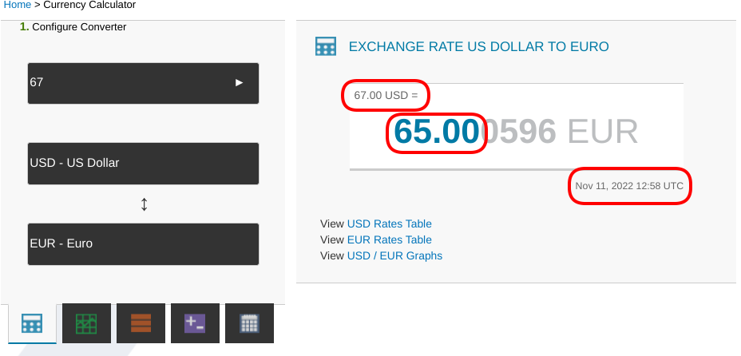
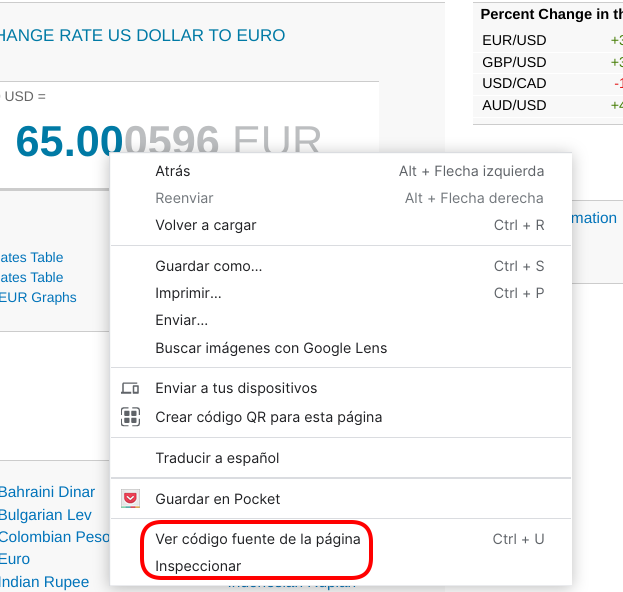
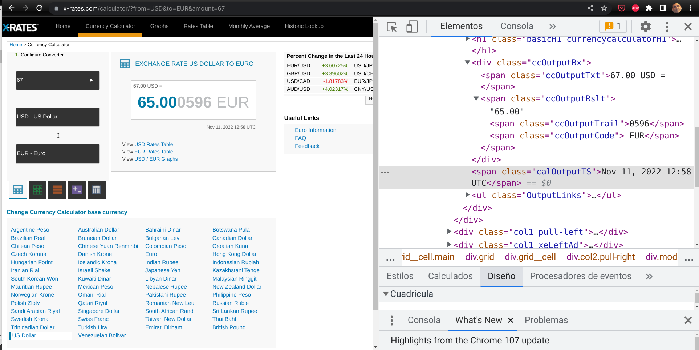
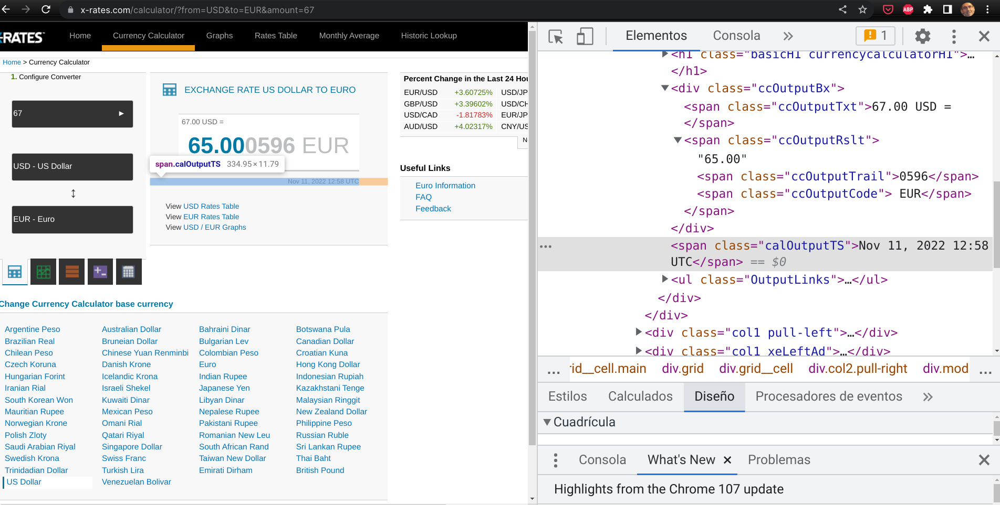
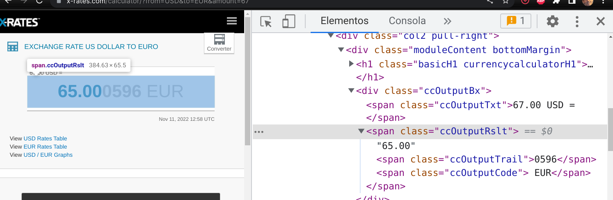
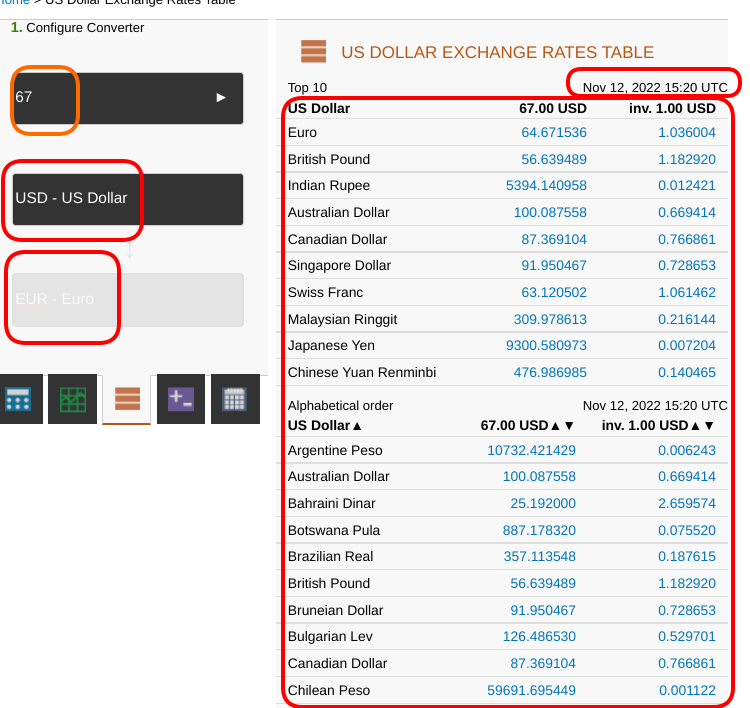

## Web scraping

Llamamos **Web scraping** a la **recuperación automática** de material de la web, procesaremos el __código__ HTML de una página web para obtener la información relevante que queremos obtener.

En muchas páginas podemos hacer llamadas concretas insertando los parámetros de la consulta en la misma URL para obtener los resultados concretos que queremos obtener. Decimos que esta página tiene un API REST, porque toda la información la proporcionamos en la llamada. 

Utilizando el módulo **requests** podemos obtener el contenido HTML de la página.

Una vez obtenido el contenido, lo procesaremos para obtener aquellos datos que nos importan. A este procesamiento la llamamos **parseado** y para ello utilizaremos un módulo llamado **BeautifullSoup** que nos permite especificar las distintas partes que queremos recuperar.

Vamos a elegir una página que nos permite calcular la conversión entre monedas: [https://www.x-rates.com/](https://www.x-rates.com/). Primero seleccionamos la moneda origen, luego la destino e introducimos la cantidad que queremos convertir. Si nos fijamos en cómo cambia la URL tras hacer la selección vemos que si seleccionamos __dólares americanos__ como moneda inicial, __éuros__ como moneda final y ponemos la cantidad inicial de __67$__ veremos que la URL es [https://www.x-rates.com/calculator/?from=USD&to=EUR&amount=67](https://www.x-rates.com/calculator/?from=USD&to=EUR&amount=67), donde comprobamos que nuestra selección se traslada directamente a la URL.



Antes de empezar con el código tenemos que inspeccionar el código HTML de la página, lo que podemos hacer con la opción de **ver código fuente**  o seleccionando la opción de **Inspeccionar** del navegador tras pulsar sobre el elemento que queremos analizar:



Tras hacer esto veremos el código fuente de la página, donde tendremos que localizar qué parte es la que representa a los datos que queremos recuperar



Con la opción de **Inspeccionar** podemos ver exáctamente qué código es el responsable de cada parte.

Vamos a recuperar de la página, la cantidad inicial, la final y la fecha de la conversión. Para ver cómo hacerlo pulsaremos sobre cada una de ellas con la opción **Inspeccionar**. Esa parte será la que luego buscaremos entre todo el contenido de la página para recuperar el contenido que nos interesa. Nos fijaremos en el tipo de bloque que es el HTML y sus características. Desde BeautifullSoup buscaremos esa parte y extraemos nuestra información. 

En la siguiente imagen vemos la parte que se encarga de la fecha



En esta imagen vamos a ver el HTML que se refiere a la cantidad final y su moneda



Necesitamos tener instalados los dos paquetes, lo que haremos o bien con Thonny o con pip

```sh
pip install requests
pip install bs4
```

Veamos el código: 

* Importamos los módulos que vamos a necesitar

```python
import requests
from bs4 import BeautifulSoup as bs
```

* Creamos la URL de la petición a partir de las monedas y cantidad, donde hemos usado una **f-string** para convertir los parámetros en la cadena de la URL

```python
moneda_origen = 'USD'
moneda_destino = 'EUR'
cantidad = 1.0

peticion = f'https://www.x-rates.com/calculator/?from={moneda_origen}&to={moneda_destino}&amount={cantidad}'
```

* Descargaremos el contenido de la página web que queremos procesar, usando __requests__. Tras descargarlo, comprobamos si la descarga ha ido bien, verificando que el código de la petición es **200** (código de OK para HTML). Nos quedamos con el contenido de la petición que será lo que procesaremos.

```python
respuesta = requests.get(peticion)

if respuesta.status_code != 200:
    print('Se produjo un error') # debemos dejar de procesar
    exit()
    
contenido = respuesta.content
```

* Ahora, pasamos el contenido al parseador html de BeatutifulSoup para que podamos procesarlo. En el "argot" de webscraping se suele llamar "sopa" (por la mezcla de contenidos que nos encontramos)

```python
soup = bs(contenido,'html.parser')
```

* A partir de este punto vamos a ir buscando y seleccionando los elementos que queremos recuperar usando el método **find_all**. Para ello nos fijaremos en el tipo de elemento y sus atributos, que lo distinguen de los otros elementos del mismo tipo. Para el elemento de la cantidad de entrada buscaremos los elementos de tipo "span" y con atributo "class" de valor "ccOutputTxt", quedándonos con el primero (find_all devuelve una lista de elementos encontrados) y con su atributo "text" que es el contenido

```python
span_In_value = soup.find_all('span',attrs={"class":"ccOutputTxt"})

texto_In = span_In_value[0].text
```

* Puesto que estamos suponiendo que la página tiene determinada estructura, debemos comprobar si encontramos la cantidad de elementos esperada. Hay que recalcar que **el formato de la página puede modificarse con cualquier cambio que haga el diseñador**.

```python
    if len(span_In_value) != 1:
        print('Error de parseado en in:',span_In_value)
        exit()
```

* Para realizar esta parte de selección del contenido que queremos resulta cómodo utilizar la consola, donde podemos ir comprobando si obtenemos el resultado requerido.

* Para la cantidad de salida haremos una búsqueda similar, solo que usaremos otro valor para el atributo "class":

```python
span_Out_value = soup.find_all('span',attrs={"class":"ccOutputRslt"})
if len(span_Out_value) != 1:
    print('Error de parseado en out:',span_Out_value)
    return

texto_Out = span_Out_value[0].text
```

* Y para la fecha de la operación:

```python
span_fecha = soup.find_all('span',attrs={"class":"calOutputTS"})[0].text

texto_fecha = span_fecha
```

* Ya solo nos queda generar una cadena con el resultado

```python
print(f'{texto_In} -> {texto_Out}  -  {texto_fecha}') 
```

* Vamos a empaquetar todo en una función a la que podemos llamar usando distintas monedas e importes:


```python
import requests
from bs4 import BeautifulSoup as bs

def conversion_monedas(moneda_origen = 'USD',moneda_destino = 'EUR',cantidad = 1.0):
    print('Conversion de monedas {moneda_origen} a {moneda_destino}')
    peticion = f'https://www.x-rates.com/calculator/?from={moneda_origen}&to={moneda_destino}&amount={cantidad}'
    respuesta = requests.get(peticion)

    if respuesta.status_code != 200:
        print('Se produjo un error')
        return
        
    contenido = respuesta.content

    soup = bs(contenido,'html.parser')

    span_In_value = soup.find_all('span',attrs={"class":"ccOutputTxt"})
    if len(span_In_value) != 1:
        print('Error de parseado en in:',span_In_value)
        return
    
    texto_In = span_In_value[0].text

    span_Out_value = soup.find_all('span',attrs={"class":"ccOutputRslt"})
    if len(span_Out_value) != 1:
        print('Error de parseado en out:',span_Out_value)
        return
    
    texto_Out = span_Out_value[0].text
    
    span_fecha = soup.find_all('span',attrs={"class":"calOutputTS"})[0].text
    
    texto_fecha = span_fecha# [0].text
    
    print(f'{texto_In} -> {texto_Out}  -  {texto_fecha}') 
```

Ahora vamos a hacer una conversión más compleja en la que procesaremos una tabla. El mecanismo es el mismo pero más complejo por la estructura de una tabla.



* Creamos la URL, que ahora es [https://www.x-rates.com/table/?from=USD&amount=67](https://www.x-rates.com/table/?from=USDamount=67), descargamos el contenido, chequeando que el resultado es correcto (status 200) y si es correcto creamos la sopa:

```python
import requests
from bs4 import BeautifulSoup as bs

moneda_origen = 'USD'
cantidad = 1.0


peticion = f'https://www.x-rates.com/table/?from={moneda_origen}&amount={cantidad}'

respuesta = requests.get(peticion)

if respuesta.status_code != 200:
    print('Se produjo un error')
    exit() # salimos si hay error
        
contenido = respuesta.content

soup = bs(contenido,'html.parser')
```

* Buscamos la fecha de la conversión, de un modo similar al ejemplo anterior.

```python
span_fecha = soup.find_all('span',attrs={"class":"ratesTimestamp"})[0].text

texto_fecha = span_fecha
```

* Para trabajar ahora con la tabla vamos a crear un diccionario **tasas_cambio**  donde iremos añadiendo los resultados los elementos que vamos encontrando.

* Primero buscamos todos los elementos de tipo **table** e iremos iterando en estos elementos buscando las filas **tr** y dentro de ellas las columnas **td**

```python

tablas_cambio = soup.find_all('table') # todas las tablas

tasas_cambio = {}

for tasa_cambio in tablas_cambio: # iteramos en cada tabla
    for tr in tasa_cambio.find_all('tr'): # iteramos en las filas de cada tabla
        tds = tr.find_all('td') # columnas por fila
        if tds:
            moneda = tds[0].text # columna moneda
            cambio = float(tds[1].text) # columna cambio
            tasas_cambio[moneda] = cambio # añadimos al diccionario el cambio a la moneda
```

* Ahora ya nos queda sólo mostrar los resultados encontrados

```python
print(f'Tasas de cambio del {texto_fecha} de {moneda_origen} a: ')   
for moneda,tasa_cambio in tasas_cambio.items():
    print(moneda,'->',tasa_cambio)

```

Vamos a empaquetar ahora todo el código en una función que podamos llamar usando moneda inicial e importe como argumentos

```python
import requests
from bs4 import BeautifulSoup as bs

def tabla_conversion_monedas(moneda_origen = 'USD',cantidad = 1.0):
    print(f'Tabla de conversion de monedas {moneda_origen} a {moneda_destino}')
    peticion = f'https://www.x-rates.com/table/?from={moneda_origen}&amount={cantidad}'
    respuesta = requests.get(peticion)

    if respuesta.status_code != 200:
        print('Se produjo un error')
        return
        
    contenido = respuesta.content

    soup = bs(contenido,'html.parser')
    
    span_fecha = soup.find_all('span',attrs={"class":"ratesTimestamp"})[0].text

    texto_fecha = span_fecha
    
    tablas_cambio = soup.find_all('table')
    tasas_cambio = {}
    
    for tasa_cambio in tablas_cambio:
        for tr in tasa_cambio.find_all('tr'):
            tds = tr.find_all('td')
            if tds:
                moneda = tds[0].text
                cambio = float(tds[1].text)
                tasas_cambio[moneda] = cambio
                
    print(f'Tasas de cambio del {texto_fecha} de {moneda_origen} a: ')   
    for moneda,tasa_cambio in tasas_cambio.items():
        print(moneda,'->',tasa_cambio)
```

[Código](./codigo/tabla_conversion_moneda.py)

## Documentación

[Documentacion de Beautiful Soup](https://www.crummy.com/software/BeautifulSoup/bs4/doc/)

[Tutorial BeautifulSoup](https://j2logo.com/python/web-scraping-con-python-guia-inicio-beautifulsoup/)

